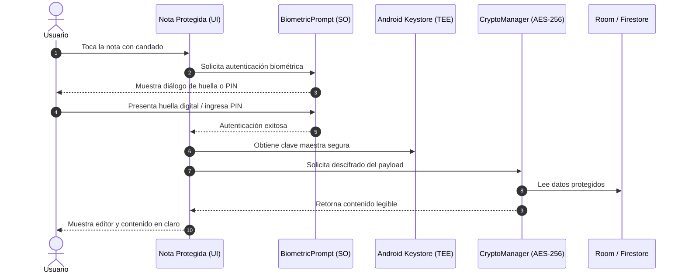

# PassVaultSec 🔐

> **Aplicación nativa para Android 13 y posteriores (API 33+)** que combina la simplicidad, dinamismo y experiencia de usuario de **Google Keep** con una **capa de seguridad militar (cifrado AES-256-GCM + Android Keystore)**, bloqueo granular por **huella dactilar o PIN** (`BiometricPrompt`), y la posibilidad de **compartir notas colaborativas en tiempo real** con otros usuarios mediante sus cuentas de Google (Firebase Auth + Cloud Firestore).

---

## 🚀 Características Principales

### 1. Experiencia de Usuario estilo Google Keep
- **Diseño moderno Material You / Material Design 3** con colores dinámicos y adaptación automática al tema del sistema (Claro / Oscuro).
- **Vista flexible**: Alterna con un solo toque entre **cuadrícula escalonada (*staggered grid*)** de 2 columnas o lista vertical.
- **Notas de texto y listas de verificación (*Checklists*)**: Casillas interactivas, tareas tachadas y reordenables.
- **Paleta de colores icónica**: Selector de tonos pastel (rojo, naranja, amarillo, verde, azul, morado, etc.) para organizar visualmente tus notas.
- **Fijado y archivo**: Fija notas prioritarias en la parte superior y archiva notas sin eliminarlas.
- **Búsqueda instantánea**: Filtra en tiempo real por título, contenido y etiquetas.

### 2. Capa de Seguridad y Privacidad
- **Cifrado AES-256-GCM con Android Keystore**:
  - Las llaves criptográficas se generan y custodian dentro del hardware seguro (**TEE / StrongBox**) del dispositivo, garantizando que nunca queden expuestas en memoria o almacenamiento ordinario.
  - Generación de vectores de inicialización (IV) criptográficos aleatorios de 12 bytes por cada nota.
- **Bloqueo Granular por Nota (`BiometricPrompt`)**:
  - Puedes proteger notas individuales con un candado.
  - En la lista general, las notas bloqueadas muestran el título protegido y ocultan su contenido detrás de una máscara de seguridad.
  - Compatible con sensores de **huella dactilar**, **desbloqueo facial seguro** y respaldo automático con el **PIN/patrón del dispositivo Android**.
- **Protección contra Capturas de Pantalla (`FLAG_SECURE`)**:
  - Al abrir y editar notas confidenciales, la ventana se marca automáticamente con `FLAG_SECURE`, impidiendo capturas de pantalla o grabaciones no autorizadas y ocultando la vista previa en el selector de aplicaciones recientes.

### 3. Notas Compartidas y Colaboración en Tiempo Real
- **Autenticación con Google**: Integración moderna con la API `CredentialManager` de Android 13+ para inicio de sesión en un toque.
- **Control de Acceso Granular**:
  - **Propietario (*Owner*)**: Control total, puede añadir/remover colaboradores o eliminar la nota.
  - **Editor**: Puede leer y editar el contenido o checklist de la nota en tiempo real.
  - **Lector (*Viewer*)**: Acceso de solo lectura protegido contra ediciones accidentales.
- **Reglas de Seguridad en Cloud Firestore (`firestore.rules`)**:
  - Verificación estricta en el servidor para asegurar que únicamente los usuarios autorizados tengan acceso a los datos.

---

## 🛠️ Stack Tecnológico

| Capa | Tecnologías |
| :--- | :--- |
| **Plataforma** | Android 13+ (`minSdk = 33`, `targetSdk = 35`, `compileSdk = 35`) |
| **Lenguaje** | Kotlin 2.0+ con Coroutines & Flow |
| **UI** | Jetpack Compose + Material 3 + Navigation Compose |
| **Criptografía** | Android Keystore + AES-256-GCM + AndroidX Biometric 1.2.0 |
| **Persistencia Local** | Room Database 2.6 + TypeConverters Gson (Offline-First) |
| **Backend & Cloud** | Firebase Authentication (Google Sign-In) + Cloud Firestore |
| **Arquitectura** | Clean Architecture (Domain, Data, Presentation) + MVVM |

---

## 📁 Estructura del Proyecto

```
PassVaultSec/
├── app/
│   ├── build.gradle.kts
│   ├── google-services.json                # Configuración de Firebase
│   ├── proguard-rules.pro
│   └── src/
│       ├── main/
│       │   ├── AndroidManifest.xml         # Permisos: BIOMETRIC, INTERNET, NOTIFICATIONS
│       │   ├── java/com/passvaultsec/app/
│       │   │   ├── PassVaultApplication.kt # Punto de entrada y ServiceLocator
│       │   │   ├── core/
│       │   │   │   ├── auth/GoogleAuthManager.kt        # Credential Manager + Firebase
│       │   │   │   ├── security/CryptoManager.kt       # Motor AES-256 Keystore
│       │   │   │   ├── security/BiometricAuthManager.kt# BiometricPrompt Huella/PIN
│       │   │   │   └── ui/theme/Theme.kt               # Paleta Material 3 y colores Keep
│       │   │   ├── domain/
│       │   │   │   ├── model/Note.kt                   # Modelo con reglas de permisos
│       │   │   │   ├── model/ChecklistItem.kt
│       │   │   │   ├── model/Collaborator.kt
│       │   │   │   └── repository/NoteRepository.kt
│       │   │   ├── data/
│       │   │   │   ├── local/AppDatabase.kt            # Base de datos Room
│       │   │   │   ├── local/dao/NoteDao.kt
│       │   │   │   ├── local/entity/NoteEntity.kt
│       │   │   │   ├── remote/FirestoreService.kt      # Sincronización en tiempo real
│       │   │   │   └── repository/NoteRepositoryImpl.kt
│       │   │   └── presentation/
│       │   │       ├── MainActivity.kt                 # Host de navegación y FLAG_SECURE
│       │   │       ├── notes/                          # Dashboard estilo Keep
│       │   │       ├── editor/                         # Editor de notas y checklists
│       │   │       └── auth/                           # Gestión de cuenta Google
│       │   └── res/                                    # Recursos de colores, temas y textos
│       └── test/                                       # Pruebas unitarias
├── firestore.rules                                     # Reglas de seguridad de Firestore
├── settings.gradle.kts
└── build.gradle.kts
```

---

## ⚙️ Instrucciones de Configuración y Despliegue

### 1. Requisitos Previos
- **Android Studio Jellyfish | Koala | Ladybug** o superior.
- **JDK 17** o superior.
- Dispositivo físico o emulador con **Android 13 (API 33)** o posterior con bloqueo por huella o PIN configurado.

### 2. Configurar Firebase y Google Sign-In (Privacidad Garantizada)
1. Crea un proyecto en [Firebase Console](https://console.firebase.google.com/).
2. Registra una aplicación Android con el Package Name: `com.passvaultsec.app`.
3. Descarga tu archivo `google-services.json` y colócalo en la carpeta `app/google-services.json` (el archivo está protegido en `.gitignore` para no subirse a GitHub; tienes una plantilla de referencia en `app/google-services.json.example`).
4. Habilita los siguientes servicios en Firebase:
   - **Authentication**: Proveedor *Google*.
   - **Cloud Firestore**: Aplica el contenido de `firestore.rules`.
5. Copia el archivo `secrets.properties.example` como `secrets.properties` y define tu `WEB_CLIENT_ID`:
   ```properties
   WEB_CLIENT_ID=TU_CLIENT_ID.apps.googleusercontent.com
   ```
   *(Este archivo también está en `.gitignore` para mantener tus claves 100% privadas y fuera de GitHub).*

### 3. Compilación e Instalación
Abre el proyecto en Android Studio:
1. Sincroniza Gradle (`Sync Project with Gradle Files`).
2. Conecta un dispositivo Android 13+ o inicia un emulador.
3. Presiona **Run** (`Shift + F10`) para compilar e instalar el APK de depuración.

---

## 🔒 Modelo de Seguridad Detallado



---

## 🧪 Pruebas Unitarias
El proyecto cuenta con pruebas automáticas para validar:
- Lógica de permisos de edición y lectura de colaboradores (`NoteTest.kt`).
- Ciclo de cifrado y descifrado simétrico AES-256-GCM (`AesGcmCipherTest.kt`).
